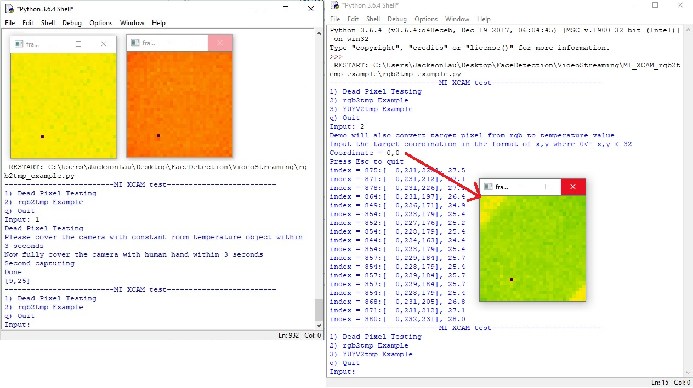

# MI_XCAM_Test
This is the testing application of using Meridian Innovation Limited 32x32 XCAM on Python.

## Settings
* XCAM_single (YUYV output thermal image)
* Non-adaptive color mapping mode
* *Using defalut colorPalette0
* SetTempDisplay(0)

## Functions
- [x] Dead Pixel Testing
- [x] rgb2tmp Example
- [ ] YUYV2tmp Example

createColorTable() : create the color table following the same algorithm on MCU, it is firmware dependent*

find_nearest(array, value): find the nearest point that matching to the target RGB value, since the cap.read() convert the YUYV stream to                               BGR internally, the convertion makes precision issue, which is why we cannot directly mapping by comparing RGB only. Also openCV does not support getting YUYV raw streaming but BGR.

"frame" is the raw data captured by cap.read() which is in BGR color space in size of 192x192, 6 times enlarged from 32x32.

Please refers to [MI_XCAM SDK](https://github.com/MeridianInnovation/MI_XCAM_formalRelease "MI_XCAM_formalRelease") for more firmware details.
